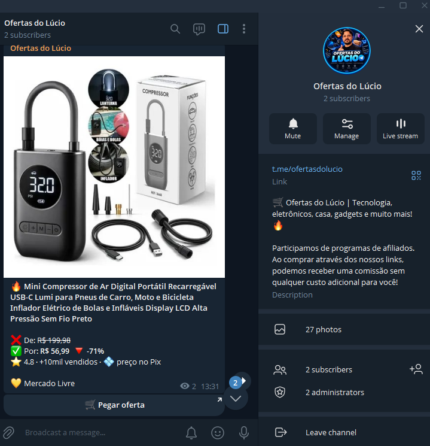

# Bot de Ofertas para Telegram 🔥

[](https://www.python.org/)
[](https://www.docker.com/)
[](https://docs.docker.com/engine/swarm/)
[](https://core.telegram.org/bots/api)
[](https://t.me/ofertasdolucio)
[](https://playwright.dev/)
[](https://opensource.org/licenses/MIT)

Um bot autônomo, modular e **100% híbrido** para Telegram que garimpa as melhores promoções no **Mercado Livre**, **Shopee** e **Amazon**, aplica automaticamente os seus links de afiliado comissionados e publica ofertas formatadas profissionalmente no seu canal ou grupo.

> 💰 **100% dos seus ganhos**: O bot não tem intermediários nem taxas. Todas as comissões geradas pelas vendas vão direto para as suas próprias contas de afiliado das plataformas.

<p align="center">
  
  <br>
  <em>Exemplo real de oferta garimpada e postada automaticamente no canal com foto, desconto e botão de afiliado</em>
</p>

> 📢 **Veja o bot em ação na prática!**  
> Criamos um canal demonstrativo no Telegram gerado 100% por este bot para você conferir a velocidade e a qualidade das postagens ao vivo:  
> 👉 **[Entre no canal Ofertas do Lúcio (t.me/ofertasdolucio)](https://t.me/ofertasdolucio)** para experimentar e acompanhar!

---

## 🌟 Por que este bot é Híbrido?

Este projeto foi desenhado para atender perfeitamente aos **dois principais perfis de uso**:

```
                  ┌─────────────────────────────────────────┐
                  │        BOT DE OFERTAS TELEGRAM          │
                  └────────────────────┬────────────────────┘
                                       │
            ┌──────────────────────────┴──────────────────────────┐
            ▼                                                     ▼
┌───────────────────────┐                             ┌───────────────────────┐
│   CENÁRIO 1: NO PC    │                             │  CENÁRIO 2: NA NUVEM  │
│    (Windows/macOS)    │                             │  (VPS Linux / Docker) │
├───────────────────────┤                             ├───────────────────────┤
│ • Painel gráfico web  │                             │ • 24 horas x 7 dias   │
│ • Início com 2 cliques│                             │ • Docker Swarm/Compose│
│ • Sem custos de server│                             │ • Traefik com SSL auto│
│ • Perfeito p/ começar │                             │ • Alta disponibilidade│
└───────────────────────┘                             └───────────────────────┘
```

1. **No seu Computador (Windows / macOS / Linux)**:
   - Dê 2 cliques no `PAINEL.bat` e configure tudo por um **painel visual no navegador** sem tocar no terminal.
   - Faça login único no Mercado Livre em uma janela normal do Chrome.
   - Ideal para quem não quer gastar com servidor e prefere rodar enquanto usa o PC.

2. **Na Nuvem 24x7 (VPS Ubuntu / Docker / Portainer Swarm / Traefik)**:
   - Container pronto com **Playwright + Chromium headless** para Linux.
   - **Ponte de Sessão Inteligente (`ml_state.json`)**: os cookies do Mercado Livre são sincronizados com um único arquivo leve (9 KB) e **auto-renovados a cada ciclo** de scraping, mantendo o bot ativo 24/7 sem expirar.
   - Integração pronta com Docker Swarm, Portainer e Traefik (HTTPS com Let's Encrypt automático).

---

## ⚡ Funcionalidades Principais

* **Garimpo Automático Multi-Loja**:
  * **Mercado Livre**: Garimpa a página de ofertas reais com alta taxa de desconto e gera links curtos oficiais `meli.la/...` via motor Linkbuilder integrado.
  * **Shopee**: Integração via Open API oficial de Afiliados (GraphQL), buscando por palavras-chave ou ofertas em destaque com links rastreados.
  * **Amazon**: Coleta ofertas por departamento ou busca com aplicação imediata da sua tag de associado (`seunome-20`) ou via Creators API.
* **Layout Visual Atraente no Telegram**:
  * Imagem em alta resolução do produto.
  * Título formatado e limpo.
  * Comparativo de preço: **De R$ X por R$ Y** (com desconto percentual em destaque).
  * Botão inline interativo: `🛒 Ver Oferta no Mercado Livre / Shopee / Amazon`.
* **Dois Modos de Publicação**:
  1. **Piloto Automático (24x7)**: Roda em ciclos periódicos (ex: a cada 45 minutos), seleciona os maiores descontos, faz rodízio entre as plataformas e posta sozinho.
  2. **Conversor Manual (No privado do Bot)**: Envie qualquer link de produto no privado do seu bot. Ele extrai os dados, gera o link de afiliado e responde com uma prévia interativa com botões `[ ✅ Postar no Canal ]` e `[ 🗑 Descartar ]`.
* **Banco de Dados Anti-Repetição (SQLite)**:
  * Nunca repete a mesma oferta dentro do intervalo de dias configurado (padrão 7 dias).
* **Filtros e Nichos Customizáveis**:
  * Defina desconto mínimo (ex: apenas itens acima de 25% OFF).
  * Limites de preço mínimo e máximo.
  * Blacklist de palavras (bloqueie itens indesejados como capinhas, películas, etc.).
  * Restrinja para nichos específicos (ex: apenas Informática, Games, Casa & Cozinha, Moda).
* **Horário Comercial Ativo**:
  * Configure um intervalo (ex: `08:00-23:00`) para o bot não incomodar seus inscritos durante a madrugada.
* **Controle Total via Telegram**:
  * `/status`: Exibe a saúde das lojas, horário ativo, uptime e total de postagens já realizadas.
  * `/ciclo`: Dispara uma rodada de garimpo e postagem imediatamente no canal.
  * `/id`: Informa o seu ID de usuário e o ID do canal para facilitar a configuração.

---

## 🛒 Como as Plataformas de Afiliado Funcionam

| Plataforma | Origem das Ofertas | Geração do Link com Comissão | Requisitos |
|---|---|---|---|
| **Mercado Livre** | Página de Super Ofertas e categorias do ML | Linkbuilder oficial integrado (gera `https://meli.la/...`) | Conta de Afiliado ML + Login único |
| **Shopee** | Open API oficial de afiliados da Shopee | A própria API já retorna o link comissionado | App ID e App Secret da Open API Shopee |
| **Amazon** | Vitrine de Ofertas por Departamento | Aplicação automática da sua tag (`seunome-20`) ou Creators API | Tag do Amazon Associados Brasil |

---

## 🚀 Guia de Início Rápido

Escolha o cenário que melhor atende à sua necessidade:

---

### CENÁRIO 1: No seu Computador (Windows)

#### 1. Instalação rápida do `uv`
Abra o **PowerShell** do Windows e instale o gerenciador moderno de Python `uv`:
```powershell
winget install astral-sh.uv
```
*(Feche e reabra o PowerShell após a instalação).*

#### 2. Baixar o projeto
Clone este repositório ou baixe o arquivo ZIP e descompacte em uma pasta da sua preferência:
```powershell
git clone https://github.com/rlucio01/bot-ofertas-telegram.git
cd bot-ofertas-telegram
```

#### 3. Abrir o Painel Gráfico
Dê dois cliques no arquivo **`PAINEL.bat`** (ou execute no terminal):
```powershell
.\PAINEL.bat
```
O script instalará as dependências automaticamente e abrirá o painel no seu navegador (`http://localhost:8481`).

#### 4. No Painel Web:
1. **Preencha suas credenciais**: Token do Telegram, IDs e tags das lojas.
2. Clique em **Instalar Navegador** (baixa o Chromium necessário para o Mercado Livre).
3. Clique em **Fazer Login no Mercado Livre**: Uma janela do navegador será aberta; faça login na sua conta do ML e feche a janela.
4. Clique em **Ligar Bot**. Pronto! O bot já estará garimpando e postando no canal.

> [!TIP]
> **Deixar rodando em segundo plano:** Você pode fechar o painel e dar dois cliques em `run.bat` sempre que quiser iniciar o bot silenciosamente.
> Para iniciar junto com o Windows: Pressione `Win + R`, digite `shell:startup` e cole um atalho para o `run.bat`.

---

### CENÁRIO 2: Na Nuvem 24x7 (VPS Linux / Docker Swarm / Portainer)

Ideal para quem possui uma VPS (Ubuntu 22.04 / 24.04) e deseja que as ofertas sejam garimpadas e postadas 24 horas por dia, 7 dias por semana, sem precisar de computador ligado.

#### 1. Gerar os Cookies do Mercado Livre no PC
Como a VPS Linux não possui interface gráfica de login com captcha, você faz o login no seu PC local uma única vez:
```powershell
# No seu computador local:
uv run python -m ofertas ml-login
uv run python -m ofertas ml-export
```
Isso gera o arquivo portátil `data/ml_state.json` (~9 KB).

#### 2. Preparar os Diretórios na VPS
Conecte-se à sua VPS via SSH:
```bash
sudo mkdir -p /opt/bot-ofertas/data
sudo chown -R $USER:$USER /opt/bot-ofertas
```

Envie o arquivo `ml_state.json` e o `config.yaml` do seu PC para a VPS:
```powershell
# No PowerShell do seu PC:
scp data/ml_state.json usuario@ip_da_vps:/opt/bot-ofertas/data/
scp config.yaml usuario@ip_da_vps:/opt/bot-ofertas/
```

#### 3. Subir via Docker Compose (Modo Simples)
Na VPS, crie o arquivo `.env` na pasta `/opt/bot-ofertas/.env` com suas credenciais (veja [.env.example](.env.example)) e execute:
```bash
cd /opt/bot-ofertas
docker compose up -d --build
```

#### 4. Subir via Portainer (Docker Swarm com Traefik SSL)
Se você usa Docker Swarm com Traefik:
1. No Portainer, acesse **Swarm** → **Stacks** → **+ Add Stack**.
2. Nome: `bot-ofertas`.
3. Cole o conteúdo do arquivo [`portainer-stack-swarm.yml`](portainer-stack-swarm.yml).
4. Na seção **Environment Variables**, preencha:
   * `DOMAIN`: seu domínio (ex: `ofertas.seudominio.com`)
   * `TELEGRAM_BOT_TOKEN`, `TELEGRAM_CHAT_ID`, `TELEGRAM_OWNER_ID`
   * `ML_ETIQUETA`, `AMAZON_TAG`, `SHOPEE_APP_ID`, `SHOPEE_APP_SECRET`
   * `APP_MODE`: `run` (modo silencioso 24x7) ou `painel` (painel web protegido por Traefik)
5. Clique em **Deploy the stack**.

> [!NOTE]
> Consulte o guia completo com prints e dicas de segurança em: **[DEPLOY_VPS_PORTAINER.md](DEPLOY_VPS_PORTAINER.md)**.

---

## 🔑 Como Obter as Credenciais Necessárias

### 1. Telegram (Bot e Canal)
1. Abra o Telegram e converse com o [@BotFather](https://t.me/BotFather).
2. Envie o comando `/newbot`, escolha um nome e um `@username` terminado em `bot`.
3. Copie o **HTTP API Token** gerado e guarde para o `TELEGRAM_BOT_TOKEN`.
4. Crie um canal público ou privado no Telegram.
5. Vá em **Administradores do Canal** → **Adicionar Administrador** → busque pelo `@username` do seu bot e conceda a permissão de **Publicar Mensagens**.
6. **Descobrir seu Chat ID e Owner ID**:
   - Inicie o bot com o token preenchido.
   - No privado do bot, envie o comando `/id` para descobrir o seu `TELEGRAM_OWNER_ID`.
   - Encaminhe qualquer mensagem do seu canal para o bot para descobrir o `TELEGRAM_CHAT_ID`.

### 2. Menu de Comandos Azul no Telegram
Para que os comandos apareçam como um menu interativo no Telegram:
1. No [@BotFather](https://t.me/BotFather), envie `/setcommands`.
2. Selecione o seu bot e envie o texto abaixo:
```text
status - Ver saúde das fontes e estatísticas
ciclo - Disparar ciclo imediato de postagens
id - Descobrir meu ID de usuário e ID do canal
```

### 3. Mercado Livre Afiliados
1. Cadastre-se no [Programa de Afiliados do Mercado Livre](https://www.mercadolivre.com.br/afiliados).
2. No menu **Linkbuilder**, copie o código da sua **"Etiqueta em uso"** (ex: `minhatag`) e salve como `ML_ETIQUETA`.
3. Faça o login único através do comando `uv run python -m ofertas ml-login`.

### 4. Shopee Afiliados
1. Acesse o [Portal de Afiliados Shopee](https://affiliate.shopee.com.br/).
2. No menu lateral, acesse **Open API** (ou *Abrir API*).
3. Copie o seu **App ID** e o seu **App Secret** e preencha em `SHOPEE_APP_ID` e `SHOPEE_APP_SECRET`.

### 5. Amazon Associados
1. Acesse o [Amazon Associados Brasil](https://associados.amazon.com.br/).
2. Copie o seu **ID de Associado** no canto superior direito (ex: `seunome-20`) e preencha em `AMAZON_TAG`.
3. *(Opcional)*: Se possuir acesso à *Creators API*, preencha `AMAZON_CREDENTIAL_ID` e `AMAZON_CREDENTIAL_SECRET`.

---

## ⚙️ Personalização de Filtros e Nichos (`config.yaml`)

O arquivo [`config.yaml`](config.yaml) permite afinar completamente o comportamento do garimpeiro:

```yaml
geral:
  intervalo_minutos: 45        # Frequência dos ciclos automáticos
  max_posts_por_ciclo: 3       # Máximo de produtos postados por ciclo
  espacamento_segundos: 120    # Intervalo entre posts para evitar flood
  nao_repetir_dias: 7          # Quantos dias esperar antes de repostar o mesmo item
  horario_ativo: "08:00-23:00" # Horário operacional (evita posts de madrugada)

filtros:
  desconto_minimo: 25          # % mínimo de desconto real para postar
  preco_minimo: 20             # Ignora produtos muito baratos (ex: R$ 20)
  preco_maximo: 5000           # Ignora produtos acima desse teto
  palavras_bloqueadas:         # Lista negra de termos
    - capinha
    - pelicula
    - cabo

fontes:
  mercadolivre:
    ativa: true
    categorias: {}             # Vazio = todas as categorias; ou especifique ex: MLB1051 (Celulares)
  amazon:
    ativa: true
    departamentos: {}          # Vazio = todas; ou especifique ex: electronics, computers
    buscas: ["echo dot", "kindle"]
  shopee:
    ativa: true
    buscas: ["fone bluetooth", "gamer", "air fryer"]
```

---

## 💻 Referência dos Comandos CLI

Você pode executar ações diretamente via linha de comando:

| Comando | Descrição |
|---|---|
| `uv run python -m ofertas check` | Valida credenciais do `.env` e checa a saúde das integrações |
| `uv run python -m ofertas run` | Inicia o bot interativo + agendador de ciclos automáticos |
| `uv run python -m ofertas painel` | Abre o painel de controle web gráfico na porta 8481 |
| `uv run python -m ofertas ciclo` | Força a execução de um ciclo completo imediatamente |
| `uv run python -m ofertas ml-login` | Abre navegador com interface gráfica para login único no ML |
| `uv run python -m ofertas ml-export` | Exporta a sessão ativa do ML para `data/ml_state.json` |
| `uv run python -m ofertas testar ml` | Simula o garimpo no Mercado Livre e lista os descontos no terminal |
| `uv run python -m ofertas testar shopee` | Simula o garimpo na Shopee e lista as ofertas |
| `uv run python -m ofertas testar amazon` | Simula o garimpo na Amazon |
| `uv run python -m ofertas converter <URL>` | Converte qualquer link para link de afiliado sem postar |
| `uv run python -m ofertas postar <URL>` | Converte e publica o link diretamente no canal configurado |

---

## 📁 Estrutura do Repositório

```text
bot-ofertas-telegram/
├── config.yaml               # Parâmetros operacionais e filtros de nicho
├── .env.example              # Modelo de variáveis de ambiente
├── requirements.txt          # Dependências pip para Docker
├── pyproject.toml / uv.lock  # Gerenciamento uv local
├── Dockerfile                # Imagem de produção com Chromium e Python 3.12
├── docker-compose.yml        # Orquestração local / standalone
├── portainer-stack-swarm.yml # Stack oficial para Docker Swarm com Traefik
├── PAINEL.bat / run.bat      # Executáveis rápidos para Windows
├── MANUAL_DO_BOT.md          # Manual aprofundado de comandos e dicas
├── DEPLOY_VPS_PORTAINER.md   # Passo a passo completo para VPS e Docker Swarm
│
└── ofertas/                  # Código-fonte da aplicação
    ├── __main__.py / main.py # CLI e ponto de entrada
    ├── bot_interativo.py     # Bot do Telegram, handlers e JobQueue
    ├── config.py             # Validação e leitura de configurações
    ├── db.py                 # Banco anti-repetição SQLite (data/ofertas.db)
    ├── formatter.py          # Formatação dos posts em HTML
    ├── models.py             # Modelos de dados das ofertas
    ├── nichos.py             # Mapeamento de categorias e nichos
    ├── painel.py             # Servidor HTTP do painel web
    ├── pipeline.py           # Pipeline: Coleta -> Filtro -> Escolha -> Afiliado -> Post
    ├── telegram_poster.py    # Envio de mídias e botões para o Telegram
    └── sources/              # Módulos das lojas (ML, Shopee, Amazon)
```

---

## ⚖️ Conformidade e Boas Práticas

* **Aviso Legal Obrigatório**: As regras dos programas de afiliados (especialmente da Amazon) exigem transparência. Insira na descrição ou nas mensagens fixadas do seu canal:
  > *"Como participante dos programas de afiliados do Mercado Livre, Shopee e Amazon, podemos receber uma comissão pelas compras qualificadas realizadas através dos links postados, sem nenhum custo adicional para você."*
* **Segurança de Segredos**: Nunca cometa o arquivo `.env` nem a pasta `data/`. Eles estão devidamente incluídos no `.gitignore`.
* **Réplica Única no Docker Swarm**: Devido à arquitetura de *long-polling* do Telegram (`getUpdates`), execute sempre com `replicas: 1` para evitar erros de concorrência (`HTTP 409 Conflict`).

---

## 👏 Créditos e Agradecimentos

Este projeto foi inspirado e baseado no projeto original e tutorial em vídeo de **Kenzo Nakagawa**.

* 📺 **Tutorial em Vídeo (Instalação Local no PC)**: [Assista ao vídeo no YouTube](https://youtu.be/Wjt_LMtGftI?si=5ruxvaG5ORmTT5Dj)
* Deixamos aqui nosso agradecimento e os devidos créditos ao Kenzo por compartilhar a base inicial da automação local! A partir desse conceito, evoluímos a solução para uma arquitetura **100% híbrida**, adicionando suporte completo a **Linux, Docker, Docker Swarm com Traefik (VPS 24x7) e persistência inteligente de sessão via `ml_state.json`**.

---

## 📄 Licença

Distribuído sob a licença **MIT**. Veja `LICENSE` para mais detalhes. Sinta-se livre para usar, modificar e contribuir!
